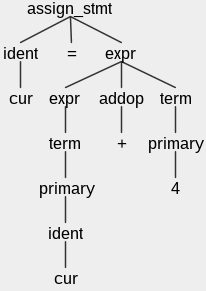

## Project Summary:

This is a complete and functional compiler development project.

This compiler is built for a new language `MicroC` (or `uC`), which is a new language I developed. `MicroC` is a simplified version of C language, which combines the grammars from several different programming languages, such as Java, Python, and C. `MicroC` is an Object-oriented programming language, and it supports many critical components of a programming language, such as control structures (if, while), functions, type checking, explicit/implicit type conversions, arrays, pointers, etc.

This compiler development project uses a parser generator: [ANTLR](https://www.antlr.org/), to generate a parser in Java that can build and walk parse trees from `MicroC` grammar. Then, ANTLR can be configured to automatically generate ASTs (Abstract Syntax Tree). Finally, we perform a walk of the generated ASTs and generate Risc-V assembly codes.

Besides, this compiler also performs register allocation to minimize the number of loads and stores by doing basic block splitting and global/local variables liveness analysis. 

To test this compiler, please use the following codes. To learn the details of these codes, please refer to the 'Build and Test the Compiler' section.

```
$ make clean; make compiler
rm -rf build classes
mkdir build classes
antlr -o build MicroC.g4
javac -cp $CLASSPATH -d classes java/*.java build/*.java
$ ./runme AllTests/testsX/testY.uc out
$ diff out AllOutputs/outputsX/testY.out
```

## Background of Compiler

The first step of a compiler is checking whether a program is valid: 1. Does it use the correct "vocabulary" (keywords, operators, variable names); 2. Does it use proper "grammar" (do for and while loops have the correct structure, etc.)? A compiler uses two tools to accomplish the validation check:

1. A *scanner* that reads in a stream of characters and *tokenizes* them into the constituent words of the language -- the keywords, operators, variable names, etc.
2. A *parser* that consumes a stream of tokens (as identified by the scanner) into a *parse tree*, which is a representation of the structure of the program.

Example:

```
cur = cur + 4;
```

The *scanner* will convert the code above into 6 tokens: 

```
IDENT(cur) OP(=) IDENT(cur) OP(+) LIT(4) SEMI
```

The *parser* will then convert this stream of tokens (generated by *scanner*) into a parse tree to capture the code's structure:




## Background of [ANTLR](https://www.antlr.org/)

ANTLR (ANother Tool for Language Recognition) is a recursive descent parser generator tool, by reading grammar and token definitions. It can also be configured to automatically generate ASTs (Abstract Syntax Tree), which are hierarchical representations of the syntactic structure of a program.

ANTLR program has a `.g4` file to define the structure of the programming language. In this project, the structure of `MicroC` is defined in `java/MicroC.g4`, the details of tokens and grammar definitions can be found on the [ANTLR website](https://www.antlr.org/).

### Examples of definitions in `MicroC.g4`:

1. Variable Declaration:

```
var_decl : type ident ';' {st.addVariable($type.t, $ident.text);};
```
   
2. Function Declaration:

```
func_decl : func_type ident '(' params ')' ';' {st.addFunction($func_type.t, $ident.text, $params.types);};
```

3. If/Else Statement:

```
if_stmt returns [IfStatementNode node] : 'if' '(' cond ')' '{' statements '}' else_stmt {$node = new IfStatementNode($cond.node, $statements.node, $else_stmt.node);};

else_stmt returns [StatementListNode node] : 'else' '{' statements '}' {$node = $statements.node;}
	| /* empty */ {$node = new StatementListNode();};
```

4. While Statement:

```
while_stmt returns [WhileNode node] : 'while' '(' cond ')' '{' statements '}' {$node = new WhileNode($cond.node, $statements.node);};
```

## Build and Test the Compiler

### Environment

Please refer to the [environment documentations](https://cap.ecn.purdue.edu/compilers/project/) to setup the environment.

### Build Compiler

The following codes show how to use ANTLR to translate the `MicroC.g4` file to generate a parser:

```
$ make
using Java
rm -rf build
mkdir build
antlr -o build MicroC.g4
```

After running the above codes, the following Java files will be generated, which include a Scanner class (`MicroCLexer.java`) and a Parser class (`MicroCParser.java`).

```
MicroC.interp		MicroCLexer.interp	MicroCListener.java
MicroC.tokens		MicroCLexer.java	MicroCParser.java
MicroCBaseListener.java	MicroCLexer.tokens
```

The following codes in `java/compiler/Compiler.java` show how to use the Scanner to turn an input stream into a stream of tokens; and then how to pass this stream of tokens to the Parser to build a parse tree.

```
MicroCLexer lexer = new MicroCLexer(CharStreams.fromFileName(args[0]));

MicroCParser parser = new MicroCParser(new CommonTokenStream(lexer));

ParseTree pt = parser.program();
```

The following code uses `java/compiler/Compiler.java` to compile the parser and lexer together to create a program. This program is used to parse any program and check if it matches the grammar.
```
javac -cp $CLASSPATH -d classes java/*.java build/*.java
```

### Test Compiler

`runme` is a shell script that runs the Scanner, as shown in the code below. This script takes two arguments: 1. the input file name; 2. the output file name. Please make sure to run `make clean; make compiler` before running `runme`.

There are 7 groups of tests in 7 different folders. Each group contains several tests that can be run. To run the `Y` test in the `X` group of tests, use the command below:

```
$ ./runme AllTests/testsX/testY.uc out
```

Finally, use this code to check the differecnes of the compiler output v.s. standard output:

```
$ diff out AllOutputs/outputsX/testY.out
```
